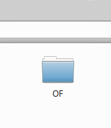
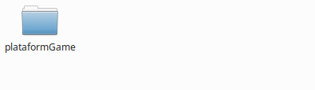

# GamePlatformOF

Platform Game maker in OpenFramework

## Getting Started

First you will need to save the project in /Documents

### Prerequisites

You need to download Openframework and install linux gcc6 or later. Work only linux. Save openframework in "/Downloads"

```
https://openframeworks.cc/download/

```


### Installing

First you need to change the project name to "plataformGame"

```
sudo mv GamePlatformOF/ plataformGame/
```

Chage name of donloaded openframework to "OF"

```
sudo mv of_vx.xx.x_linux64gcc6_release/ OF/
```

And install openframework

```
https://openframeworks.cc/setup/linux-install/

```
like this:








## Running the tests

Go project folder and run

```
https://openframeworks.cc/setup/linux-install/

```
After go to bin/ and execute

```
./plataformGame
```

### Game play

Move character

```
keys: Up, Down, Left, Right.
```


use boomerang, after get it.

```
keys: e.
```

use Arrow, after get it.

```
keys: Space.
```

use bomb, after get it.

```
keys: q and after aiming left click.
```


## My itch.io

My others games, see in itch.io [jackwill](https://jackwill.itch.io/).

## Authors

* **Jackson William Pluskota** - *Initial work* - [jacksonwilliampluskota](https://github.com/jacksonwilliampluskota)


## License

This project is licensed under the MIT License - see the [LICENSE.md](https://jack.mit-license.org/) file for details


